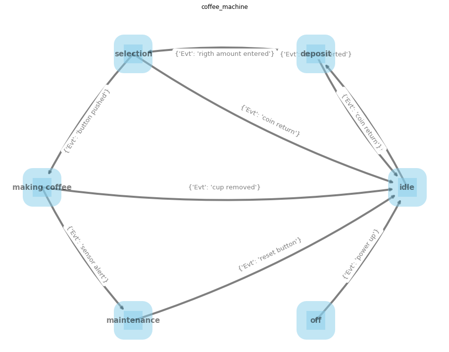

```python
# %load state_graph_example.py
"""
Created on Fri Feb 26 23:44:02 2021

@author: User
"""
import networkx as nx
import matplotlib.pyplot as plt
import pandas as pd

Evt_SYMB="Evt"

#import sys
#old_target=sys.stdout
#sys.stdout = open('state_machine_checker_v1.txt', 'w')
#

```


```python
def draw_graph(G):
    
    fig, ax = plt.subplots(figsize=(16, 12))
    
    pos = nx.circular_layout(G)
    #pos = nx.planar_layout(G)
    #pos = nx.kamada_kawai_layout(G)
    #pos = nx.multipartite_layout(G)  
    nx.draw(G, pos,with_labels=True,connectionstyle='arc3, rad = 0.07',node_size=1500, node_color="skyblue", node_shape="s", font_size=15, font_weight="bold",alpha=0.5, linewidths=40,width=4) 
    edge_labels = nx.get_edge_attributes(G,Evt_SYMB)
    nx.draw_networkx_edge_labels(G, pos, labels = edge_labels,font_color="grey",font_size=13)
    graph_title=G.graph["title"]
    plt.title(graph_title+"\n\n")
    plt.savefig(graph_title+"state_diagram_graph_structure"+".png",dpi=300) 
    
    plt.show()
    
    
def construct_graph_from_file(file_to_read=None):
    
    #load graph from file
    dfl=pd.read_csv(file_to_read)
    GFL=nx.from_pandas_edgelist(dfl,edge_attr=Evt_SYMB)
    return GFL

def construct_graph_coffee_machine(file_to_read=None):
    
    G = nx.MultiDiGraph()
    #G.add_edge("idle","idle",Evt="simple sanity check")
    G.add_edge("idle","deposit",Evt="coin inserted")
    G.add_edge("deposit","deposit",Evt="coin inserted")
    G.add_edge("deposit","idle",Evt="coin return")
    G.add_edge("deposit","selection",Evt="rigth amount entered")
    G.add_edge("selection","idle",Evt="coin return")
    G.add_edge("selection","making coffee",Evt="button pushed")
    G.add_edge("making coffee","idle",Evt="cup removed")
    G.add_edge("making coffee","maintenance",Evt="sensor alert")
    G.add_edge("maintenance","idle",Evt="reset button")
    G.add_edge("off", "idle",Evt="power up")
    #G.add_node("fake")
    # G.add_edge("idle","maintenance",Evt="self check failed")
    # G.add_edge("idle","off",Evt="power off")
    # G.add_edge("deposit","off",Evt="power off")
    # G.add_edge("selection","off",Evt="power off")
    # G.add_edge("making coffee","off",Evt="power off")
    # G.add_edge("maintenance","off",Evt="power off")
    
    G.graph["title"]="coffee_machine"
    return G


def construct_graph_pin_automata(file_to_read=None):
    
    G = nx.MultiDiGraph()
    #G.add_edge("idle","idle",Evt="simple sanity check")
    G.add_edge("start","wait for PIN",Evt="card inserted")
    G.add_edge("wait for PIN","1st try", Evt="enter PIN")
    G.add_edge("1st try","2st try", Evt="PIN not OK")
    G.add_edge("2st try","3rd try", Evt="PIN not OK")  
    G.add_edge("3rd try", "eat card", Evt="PIN not OK")  
    G.add_edge("1st try", "access to account", Evt="PIN OK")   
    G.add_edge("2st try", "access to account", Evt="PIN OK")   
    G.add_edge("3rd try", "access to account", Evt="PIN OK")   
    
    #G.add_node("fake")
    # G.add_edge("idle","maintenance",Evt="self check failed")
    # G.add_edge("idle","off",Evt="power off")
    # G.add_edge("deposit","off",Evt="power off")
    # G.add_edge("selection","off",Evt="power off")
    # G.add_edge("making coffee","off",Evt="power off")
    # G.add_edge("maintenance","off",Evt="power off")

    G.graph["title"]="pin_automata"    
    return G


def construct_graph_count_double_zeros_automata_v1(file_to_read=None):
    
    G = nx.MultiDiGraph()
    #G.add_edge("idle","idle",Evt="simple sanity check")
    G.add_edge("S1","S2",Evt="0")
    G.add_edge("S1","S1",Evt="1")
    G.add_edge("S2","S1",Evt="0")
    G.add_edge("S2","S2",Evt="1")

    # G.add_edge("maintenance","off",Evt="power off")

    G.graph["title"]="count_double_zeros_automata_v1"    
    return G


def construct_graph_count_double_zeros_automata_v2(file_to_read=None):
    
    G = nx.MultiDiGraph()
    #G.add_edge("idle","idle",Evt="simple sanity check")
    G.add_edge("S1","S2",Evt="0")
    G.add_edge("S1","S1",Evt="1")
    G.add_edge("S2","S3",Evt="0")
    G.add_edge("S2","S2",Evt="1")    
    G.add_edge("S3","S1",Evt="1")

    # G.add_edge("maintenance","off",Evt="power off")

    G.graph["title"]="count_double_zeros_automata_v1"    
    return G

def degrees(G):
    dg=pd.DataFrame(G.degree(),columns=["STATE","degree"])
    indg=pd.DataFrame(G.in_degree(),columns=["STATE","in_degree"]).drop(columns=["STATE"])
    outdg=pd.DataFrame(G.out_degree(),columns=["STATE","out_degree"]).drop(columns=["STATE"])
    
    avg_neighbourhood_dg=pd.Series(nx.average_neighbor_degree(G)).to_frame("avg_neighg_degree").reset_index().drop(columns=["index"])
    decombo=pd.concat([dg,indg,outdg,avg_neighbourhood_dg],axis=1)
    decombo=decombo.set_index("STATE")
    print(decombo)
    return decombo
        
def neigbours(G):
    nodes=list(G.nodes)
    for nd in nodes:
        a=[ngh for ngh in G[nd]]
        print(nd+" : "+str(a))

def simple_paths(G, source, target):
    #nodes of simple paths 
    simple_paths_list=nx.all_simple_paths(G, source, target)
    for path in simple_paths_list:     
        print((" -> ").join(path))

    
def hopbyhop_simple_paths(G, source, target):
    #To get each path as the corresponding list of edges, you can use the networkx.utils.pairwise() helper function:    
    paths=nx.all_simple_paths(G, source, target)
    for path in map(nx.utils.pairwise, paths):
        print(list(path),"\n")
        
    
def hopbyhop_simple_paths_and_attributes(G, source, target):
    #To get each path as the corresponding list of edges, you can use the networkx.utils.pairwise() helper function:    
    paths=nx.all_simple_paths(G, source, target)
    newpath_list=[]
    for path in map(nx.utils.pairwise, paths):
        newpath=[]
        for nodes in path:
            a,b=nodes
            c=G.get_edge_data(*nodes)[0][Evt_SYMB]
            #triple=a+" -> "+b+" : "+c
            triple=c+" : "+a+" -> "+b
            newpath.append(triple)
        newpath_list.append("] -> ".join(newpath))
    for p in newpath_list:
        print(p)
        print("\n")
            
def simple_paths_and_attributes_for_all_nodes(G):
    nodes=list(G.nodes)
    for i in nodes:
        for j in reversed(nodes):
            hopbyhop_simple_paths_and_attributes(G, i, j)           


def simple_paths_for_all_nodes(G):
    nodes=list(G.nodes)
    for i in nodes:
        for j in reversed(nodes):
            simple_paths(G, i, j)


def self_cyclic_nodes_in_the_graph(G):
    sc=list(nx.nodes_with_selfloops(G))
    print(sc)
    return sc

    
def simple_cycles_for_all_nodes(G):
    cycles=list(nx.simple_cycles(G))
    for c in cycles:
        print(c)
    return cycles

def simple_cycles_and_attributes_for_all_nodes(G):
    #To get each path as the corresponding list of edges, you can use the networkx.utils.pairwise() helper function:    
    paths=list(nx.simple_cycles(G))
    for path in paths:
        ## add start node to the end  --> to see complete sequence of Evts in the cycle
        path.append(path[0])
    newpath_list=[]
    for path in map(nx.utils.pairwise, paths):

        newpath=[]
        for nodes in path:
            a,b=nodes
            c=G.get_edge_data(*nodes)[0][Evt_SYMB]
            #triple=a+" -> "+b+" : "+c
            triple=c+" : "+a+" -> "+b
            newpath.append(triple)
        newpath_list.append("] -> ".join(newpath))
    for p in newpath_list:
        print(p)
        print("\n")

def nodes_in_the_graph(G,verbose=True):
    nodes=list(G.nodes)
    if verbose==True:
        print(nodes)
    return(nodes)

def edges_and_attributes_in_the_graph_v1(G):
    res=[]
    for node1, node2, data in G.edges.data():
        print(node1+" -> "+node2+" : "+str(data))
        res.append((node1,node2,data))
    return(res)

def edges_and_attributes_in_the_graph_v2(G,attr=Evt_SYMB,verbose=True):
    res=[]
    dd=nx.get_edge_attributes(G, attr)
    for k,v in dd.items():
        node1=k[0]
        node2=k[1]
        edge_label=v
        res.append((node1,node2,edge_label))
        if verbose==True:
            print(node1+" -> "+node2+" : "+edge_label)
    return res

def edge_types_in_the_graph(G,verbose=True):
    edge_types=[]
    for node1, node2, data in G.edges.data():
        edge_types.append(data[Evt_SYMB])
    edge_types=set(edge_types)
    if verbose==True:
        print(edge_types)
    return(list(edge_types))
    
def shortest_paths_for_all_nodes(G):
    sp=list(nx.all_pairs_shortest_path_length(G))
    print(sp)
    return sp


def unconnected_nodes_in_the_graph(G):
    unc=list(nx.isolates(G))
    print(unc)
    return unc

def TransitionTable(G):
    edgetypes=edge_types_in_the_graph(G,verbose=False)
    nodetypes=nodes_in_the_graph(G,verbose=False)
    transtable=pd.DataFrame({},columns=edgetypes,index=nodetypes).fillna("_")
    trans=edges_and_attributes_in_the_graph_v2(G,attr=Evt_SYMB,verbose=False)
    for tran in trans:
        s,t,e=tran
        transtable.loc[s,e]=t
    with pd.option_context('display.max_rows', None, 'display.max_columns', None):  # more options can be specified also
        print(transtable)
        
def condensed_graph(G):
    GC=nx.condensation(G)
    mapping_dict=GC.graph["mapping"]
    count_of_mapped_nodes=len(list(set(mapping_dict.values())))
    print("count of final nodes:",count_of_mapped_nodes)

    print("node mappings:\n",GC.graph["mapping"])
    return GC
   

```


```python
G=construct_graph_coffee_machine()
#G=construct_graph_from_file("coffee_machinestate_diagram_graph_structure.csv")
#G=construct_graph_pin_automata()
#G=construct_graph_count_double_zeros_automata_v1()
#G=construct_graph_count_double_zeros_automata_v2()

# nx.number_of_edges(u="making coffee", v="idle")
# simple_paths(G, source="making coffee", target="idle")
# hopbyhop_simple_paths(G, source="making coffee", target="idle")
# hopbyhop_simple_paths_and_attributes(G, source="making coffee", target="idle")
# hopbyhop_simple_paths_and_attributes(G, source="idle", target=["making coffee","maintenance"])

```


```python
print("STATES:")
nodes=nodes_in_the_graph(G)
print("Number of states: ", G.order())
print("Number of transitions: ", G.size())
print("")

```

    STATES:
    ['idle', 'deposit', 'selection', 'making coffee', 'maintenance', 'off']
    Number of states:  6
    Number of transitions:  10
    
    


```python
print("CONNECTIVITY TABLE:")
degrees(G)
print("")

```

    CONNECTIVITY TABLE:
                   degree  in_degree  out_degree  avg_neighg_degree
    STATE                                                          
    idle                6          5           1                3.0
    deposit             5          2           3                2.0
    selection           3          1           2                1.5
    making coffee       3          1           2                1.0
    maintenance         2          1           1                1.0
    off                 1          0           1                1.0
    
    


```python
print("NEIGBOUR STATES:")
neigbours(G)
print("")  

```

    NEIGBOUR STATES:
    idle : ['deposit']
    deposit : ['deposit', 'idle', 'selection']
    selection : ['idle', 'making coffee']
    making coffee : ['idle', 'maintenance']
    maintenance : ['idle']
    off : ['idle']
    
    


```python
print("EVENT TYPES")
edge_types_in_the_graph(G)
print("")

```

    EVENT TYPES
    {'power up', 'cup removed', 'button pushed', 'reset button', 'sensor alert', 'coin return', 'rigth amount entered', 'coin inserted'}
    
    


```python
print("SELF CYCLIC STATES")
self_cyclic_nodes_in_the_graph(G)
print("")

```

    SELF CYCLIC STATES
    ['deposit']
    
    


```python
print("ISOLATE/UNCONNECTED NODES")
unconnected_nodes_in_the_graph(G)
print("")

```

    ISOLATE/UNCONNECTED NODES
    []
    
    


```python
#Strong connectivity
print("STRONG CONNECTIVITY PROPERTIES:")
print("is strongly connected: ", nx.is_strongly_connected(G)) # A directed graph is strongly connected if and only if every vertex in the graph is reachable from every other vertex.
print("number of strongly connected components: ", nx.number_strongly_connected_components(G))
print("List of strongly connected components:")
print(list(nx.strongly_connected_components(G)))
print("Largest strongly connected components:")
print(max(nx.strongly_connected_components(G), key=len)) # FSM can  be strongly connected. Strongly connected FSM must include all nodes
print("Smallest strongly connected components:")
print(min(nx.strongly_connected_components(G), key=len))
print("")

```

    STRONG CONNECTIVITY PROPERTIES:
    is strongly connected:  False
    number of strongly connected components:  2
    List of strongly connected components:
    [{'making coffee', 'deposit', 'idle', 'selection', 'maintenance'}, {'off'}]
    Largest strongly connected components:
    {'making coffee', 'deposit', 'idle', 'selection', 'maintenance'}
    Smallest strongly connected components:
    {'off'}
    
    


```python
#Weak connectivity
print("WEAK CONNECTIVITY PROPERTIES:")
print("is weakly connected: ", nx.is_weakly_connected(G)) # A directed graph is weakly connected if and only if the graph is connected when the direction of the edge between nodes is ignored
print("number of weakly connected components: ", nx.number_weakly_connected_components(G))
print("List of weakly connected components:")
print(list(nx.weakly_connected_components(G)))
print("")

```

    WEAK CONNECTIVITY PROPERTIES:
    is weakly connected:  True
    number of weakly connected components:  1
    List of weakly connected components:
    [{'making coffee', 'deposit', 'idle', 'selection', 'off', 'maintenance'}]
    
    


```python
#Attracting components
print("ATTRACTING COMPONENTS PROPERTIES:")
print("is the graph attracting component: ", nx.is_attracting_component(G)) # Returns True if G consists of a single attracting component
print("number of attracting components: ", nx.number_attracting_components(G))
print("List of attracting components:")
print(list(nx.attracting_components(G))) # An attracting component in a directed graph G is a strongly connected component with the property that a random walker on the graph will never leave the component, once it enters the component.
print("")

```

    ATTRACTING COMPONENTS PROPERTIES:
    is the graph attracting component:  False
    number of attracting components:  1
    List of attracting components:
    [{'making coffee', 'deposit', 'idle', 'selection', 'maintenance'}]
    
    


```python
print("TRANSITIONS and EVENTS")
edges_and_attributes_in_the_graph_v2(G)
print("")

```

    TRANSITIONS and EVENTS
    idle -> deposit : coin inserted
    deposit -> deposit : coin inserted
    deposit -> idle : coin return
    deposit -> selection : rigth amount entered
    selection -> idle : coin return
    selection -> making coffee : button pushed
    making coffee -> idle : cup removed
    making coffee -> maintenance : sensor alert
    maintenance -> idle : reset button
    off -> idle : power up
    
    


```python
print("TRANSITIONS TABLE")
TransitionTable(G)
print("")

```

    TRANSITIONS TABLE
                  power up cup removed  button pushed reset button sensor alert  \
    idle                 _           _              _            _            _   
    deposit              _           _              _            _            _   
    selection            _           _  making coffee            _            _   
    making coffee        _        idle              _            _  maintenance   
    maintenance          _           _              _         idle            _   
    off               idle           _              _            _            _   
    
                  coin return rigth amount entered coin inserted  
    idle                    _                    _       deposit  
    deposit              idle            selection       deposit  
    selection            idle                    _             _  
    making coffee           _                    _             _  
    maintenance             _                    _             _  
    off                     _                    _             _  
    
    


```python
print("SHORTEST PATH LENGTHS ")
shortest_paths_for_all_nodes(G)
print("")

```

    SHORTEST PATH LENGTHS 
    [('idle', {'idle': 0, 'deposit': 1, 'selection': 2, 'making coffee': 3, 'maintenance': 4}), ('deposit', {'deposit': 0, 'idle': 1, 'selection': 1, 'making coffee': 2, 'maintenance': 3}), ('selection', {'selection': 0, 'idle': 1, 'making coffee': 1, 'deposit': 2, 'maintenance': 2}), ('making coffee', {'making coffee': 0, 'idle': 1, 'maintenance': 1, 'deposit': 2, 'selection': 3}), ('maintenance', {'maintenance': 0, 'idle': 1, 'deposit': 2, 'selection': 3, 'making coffee': 4}), ('off', {'off': 0, 'idle': 1, 'deposit': 2, 'selection': 3, 'making coffee': 4, 'maintenance': 5})]
    
    


```python
print("TRANSITION PATHS\n(Paths are simple paths with no repeated nodes)")
simple_paths_for_all_nodes(G)
print("")

```

    TRANSITION PATHS
    (Paths are simple paths with no repeated nodes)
    idle -> deposit -> selection -> making coffee -> maintenance
    idle -> deposit -> selection -> making coffee
    idle -> deposit -> selection
    idle -> deposit
    deposit -> selection -> making coffee -> maintenance
    deposit -> selection -> making coffee
    deposit -> selection
    deposit -> idle
    deposit -> selection -> idle
    deposit -> selection -> making coffee -> idle
    deposit -> selection -> making coffee -> maintenance -> idle
    selection -> making coffee -> maintenance
    selection -> making coffee
    selection -> idle -> deposit
    selection -> making coffee -> idle -> deposit
    selection -> making coffee -> maintenance -> idle -> deposit
    selection -> idle
    selection -> making coffee -> idle
    selection -> making coffee -> maintenance -> idle
    making coffee -> maintenance
    making coffee -> idle -> deposit -> selection
    making coffee -> maintenance -> idle -> deposit -> selection
    making coffee -> idle -> deposit
    making coffee -> maintenance -> idle -> deposit
    making coffee -> idle
    making coffee -> maintenance -> idle
    maintenance -> idle -> deposit -> selection -> making coffee
    maintenance -> idle -> deposit -> selection
    maintenance -> idle -> deposit
    maintenance -> idle
    off -> idle -> deposit -> selection -> making coffee -> maintenance
    off -> idle -> deposit -> selection -> making coffee
    off -> idle -> deposit -> selection
    off -> idle -> deposit
    off -> idle
    
    


```python
print("CYCLIC TRANSITION PATHS\n(closed paths/ circuits)")
simple_cycles_for_all_nodes(G)
print("")
print("TRANSITION PATHS AND EVENTS\n(Paths are simple paths with no repeated nodes)")
print("")
simple_paths_and_attributes_for_all_nodes(G)


```

    CYCLIC TRANSITION PATHS
    (closed paths/ circuits)
    ['deposit']
    ['making coffee', 'maintenance', 'idle', 'deposit', 'selection']
    ['making coffee', 'idle', 'deposit', 'selection']
    ['selection', 'idle', 'deposit']
    ['deposit', 'idle']
    
    TRANSITION PATHS AND EVENTS
    (Paths are simple paths with no repeated nodes)
    
    coin inserted : idle -> deposit] -> rigth amount entered : deposit -> selection] -> button pushed : selection -> making coffee] -> sensor alert : making coffee -> maintenance
    
    
    coin inserted : idle -> deposit] -> rigth amount entered : deposit -> selection] -> button pushed : selection -> making coffee
    
    
    coin inserted : idle -> deposit] -> rigth amount entered : deposit -> selection
    
    
    coin inserted : idle -> deposit
    
    
    rigth amount entered : deposit -> selection] -> button pushed : selection -> making coffee] -> sensor alert : making coffee -> maintenance
    
    
    rigth amount entered : deposit -> selection] -> button pushed : selection -> making coffee
    
    
    rigth amount entered : deposit -> selection
    
    
    coin return : deposit -> idle
    
    
    rigth amount entered : deposit -> selection] -> coin return : selection -> idle
    
    
    rigth amount entered : deposit -> selection] -> button pushed : selection -> making coffee] -> cup removed : making coffee -> idle
    
    
    rigth amount entered : deposit -> selection] -> button pushed : selection -> making coffee] -> sensor alert : making coffee -> maintenance] -> reset button : maintenance -> idle
    
    
    button pushed : selection -> making coffee] -> sensor alert : making coffee -> maintenance
    
    
    button pushed : selection -> making coffee
    
    
    coin return : selection -> idle] -> coin inserted : idle -> deposit
    
    
    button pushed : selection -> making coffee] -> cup removed : making coffee -> idle] -> coin inserted : idle -> deposit
    
    
    button pushed : selection -> making coffee] -> sensor alert : making coffee -> maintenance] -> reset button : maintenance -> idle] -> coin inserted : idle -> deposit
    
    
    coin return : selection -> idle
    
    
    button pushed : selection -> making coffee] -> cup removed : making coffee -> idle
    
    
    button pushed : selection -> making coffee] -> sensor alert : making coffee -> maintenance] -> reset button : maintenance -> idle
    
    
    sensor alert : making coffee -> maintenance
    
    
    cup removed : making coffee -> idle] -> coin inserted : idle -> deposit] -> rigth amount entered : deposit -> selection
    
    
    sensor alert : making coffee -> maintenance] -> reset button : maintenance -> idle] -> coin inserted : idle -> deposit] -> rigth amount entered : deposit -> selection
    
    
    cup removed : making coffee -> idle] -> coin inserted : idle -> deposit
    
    
    sensor alert : making coffee -> maintenance] -> reset button : maintenance -> idle] -> coin inserted : idle -> deposit
    
    
    cup removed : making coffee -> idle
    
    
    sensor alert : making coffee -> maintenance] -> reset button : maintenance -> idle
    
    
    reset button : maintenance -> idle] -> coin inserted : idle -> deposit] -> rigth amount entered : deposit -> selection] -> button pushed : selection -> making coffee
    
    
    reset button : maintenance -> idle] -> coin inserted : idle -> deposit] -> rigth amount entered : deposit -> selection
    
    
    reset button : maintenance -> idle] -> coin inserted : idle -> deposit
    
    
    reset button : maintenance -> idle
    
    
    power up : off -> idle] -> coin inserted : idle -> deposit] -> rigth amount entered : deposit -> selection] -> button pushed : selection -> making coffee] -> sensor alert : making coffee -> maintenance
    
    
    power up : off -> idle] -> coin inserted : idle -> deposit] -> rigth amount entered : deposit -> selection] -> button pushed : selection -> making coffee
    
    
    power up : off -> idle] -> coin inserted : idle -> deposit] -> rigth amount entered : deposit -> selection
    
    
    power up : off -> idle] -> coin inserted : idle -> deposit
    
    
    power up : off -> idle
    
    
    


```python
print("CYCLIC TRANSITION PATHS AND EVENTS\n(loops)")
print("")
simple_cycles_and_attributes_for_all_nodes(G)

```

    CYCLIC TRANSITION PATHS AND EVENTS
    (loops)
    
    coin inserted : deposit -> deposit
    
    
    sensor alert : making coffee -> maintenance] -> reset button : maintenance -> idle] -> coin inserted : idle -> deposit] -> rigth amount entered : deposit -> selection] -> button pushed : selection -> making coffee
    
    
    cup removed : making coffee -> idle] -> coin inserted : idle -> deposit] -> rigth amount entered : deposit -> selection] -> button pushed : selection -> making coffee
    
    
    coin return : selection -> idle] -> coin inserted : idle -> deposit] -> rigth amount entered : deposit -> selection
    
    
    coin return : deposit -> idle] -> coin inserted : idle -> deposit
    
    
    


```python

print("COLLAPSED GRAPH\n(nodes that can be merged)")
condensed_graph(G)


```

    COLLAPSED GRAPH
    (nodes that can be merged)
    count of final nodes: 2
    node mappings:
     {'making coffee': 0, 'deposit': 0, 'idle': 0, 'selection': 0, 'maintenance': 0, 'off': 1}
    


    <networkx.classes.digraph.DiGraph at 0x98a77b8>


```python
draw_graph(G)
```





```python
df=nx.to_pandas_edgelist(G)
df.to_csv(G.graph["title"]+"state_diagram_graph_structure.csv",index=False)
#sys.stdout.close()

```


```python

```


```python

```
